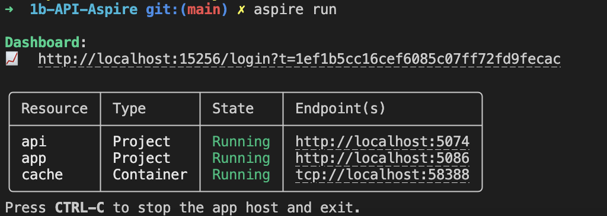

# Aspire-Demo

This is the companion repo for my talk about .NET Aspire, which illustrates a mechanism to take a cloud-native application build with Docker Compose and move it to .NET Aspire. 

There are two applications in this repo - one build with Docker Compose, and one with Aspire. 

Slides for this talk are available [here](https://docs.google.com/presentation/d/1pKHi34APKTjNJMnEQa6QBoe_FazFd_tjzxuLe4BMN38/)

## Prerequisites

You need the following installed to run the demo:

- .NET 9.0
- Docker Desktop or a local Docker installation
- An IDE or text editor, such as:
    - Visual Studio (recommended)
    - Visual Studio Code
    - JetBrains Rider

For full instructions on setting up the toolingd, please refere to the documentation in the references. 

### Optional - Aspire CLI

The Aspire CLI is a command line tool that can be used to manage .NET Aspire applications. It is not required to run the demo, but is helpful in the demo. To install

```bash 
dotnet tool install --global aspire.cli --prerelease
```

The Aspire CLI lets you create, extend and run Aspire applocations without a dependancy on .NET.



## Running the demo

The demo in this site has 2 parts, each of which is in 2 halves:

### Basic Aspire Integration


**1a-Basic-API** - A standalone API and blazor app, the exercise is to hook it up with .NET Aspire. To complete this exercise, please go through the steps in [1b-API-Aspire/Readme.md](1b-API-Aspire/Readme.md)

**1b-API-Aspire** - The same API and blazor app, but now hooked up with .NET Aspire, so to see it running you can run the project in Visual Studio by opening the solution, or by running the following

```bash
dotnet run --project ./1b-API-Aspire/apphost/apphost.csproj --launch-profile "http"
``` 

### Converting Docker Compose to Aspire

This is a more complex example, where a larger application is configured to use Docker Compose, which is then adapted to use .NET Aspire.


## References

- https://learn.microsoft.com/en-us/dotnet/aspire/ : Microsoft documentation for .NET Aspire
- https://learn.microsoft.com/en-us/dotnet/aspire/fundamentals/setup-tooling?tabs=linux&pivots=dotnet-cli - Setup tooling for .NET Aspire
- https://devblogs.microsoft.com/dotnet/category/dotnet-aspire/
    - https://devblogs.microsoft.com/dotnet/dotnet-aspire-9-1/
    - https://devblogs.microsoft.com/dotnet/dotnet-aspire-92-is-now-available-with-new-ways-to-deploy/
    - https://devblogs.microsoft.com/dotnet/introducing-dotnet-aspire-93/
- https://dotnet.microsoft.com/en-us/platform/support/policy/aspire - .NET Aspire support policy
- https://learn.microsoft.com/en-us/dotnet/aspire/fundamentals/integrations-overview : Integrations overview
- https://adolfi.dev/blog/umbraco-aspire/ : An intro to using Umbraco with .NET Aspire
- https://github.com/dotnet/aspire-samples : .NET Aspire samples